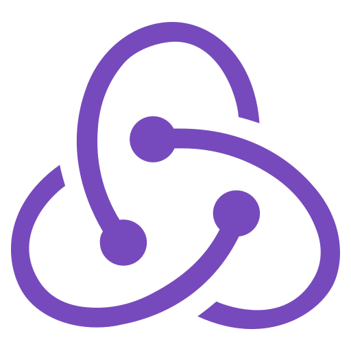
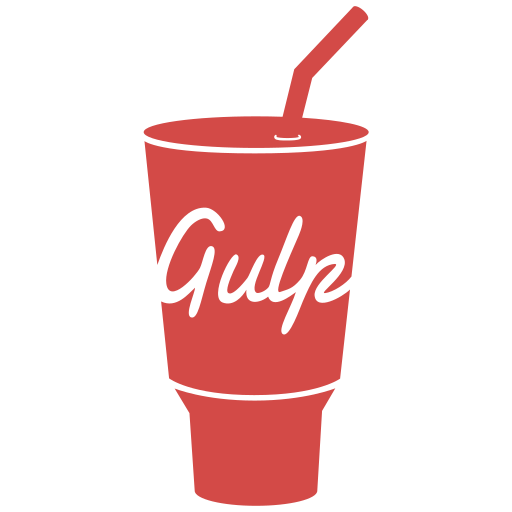
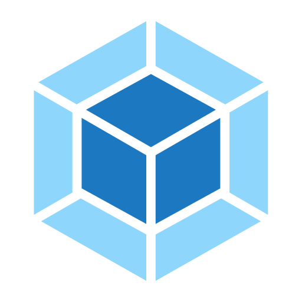

    <h1>Hi there, I'm  Roman</h1>
    <h3>Frontend Developer from Saint-Petersburg</h3>

    
  
  

### About me:
My name is Roman and I’m from Russia from not sunny Saint-Petersburg. I’m a railway engineer by education and managed to work on the construction of the subway and the design of bridges...but later I discovered world of IT.

My first acquaintance with IT began with Python and MySQL. After this I wanted to sample frontend stack and I really liked it!

I’m very glad that fate brought me together with Frontend Development because it’s very cool and I love it — it’s not just a job but also a hobby.
  
---

### Plans:
* Learn **Jest, Next**
* Upgrade my English skills to B2-level
  
---

### Skills:

&nbsp;&nbsp;
&nbsp;&nbsp;
&nbsp;&nbsp;
&nbsp;&nbsp;
&nbsp;&nbsp;
&nbsp;&nbsp;
&nbsp;&nbsp;
&nbsp;&nbsp;
&nbsp;&nbsp;
&nbsp;&nbsp;
&nbsp;&nbsp;
&nbsp;&nbsp;

---

### Stats:

   
   

